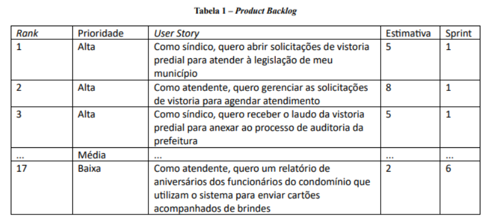
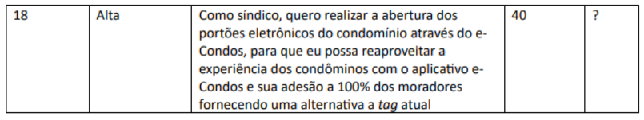

Um Product Backlog consiste numa lista priorizada de todas as User Stories do projeto. No topo devem estar todas as User Stories com maior valor agregado (Return of Investment – ROI) ao negócio. Não devem existir duas ou mais User Stories com mesmo ranking, visto que elas devem ser trabalhadas em ordem.

A Tabela 1 apresenta um exemplo de Product Backlog. Deve ser notado que as User Stories de maior importância ao ator principal devem fazer parte das primeiras Sprints. No exemplo, o fluxo principal de abertura de solicitações de vistoria e gerenciamento de solicitações estão no topo. Detalhes como gerenciamento de técnicos, configurações, entre outras funcionalidades, serão deixados para depois. Isso vai contra o pensamento geral dos desenvolvedores, mas faz sentido, visto que permite o uso do sistema imediatamente, mesmo que muitos procedimentos sigam ocorrendo de forma manual.

Por outro lado, o Item 18 representa uma User Story de alta prioridade pelo valor que ela traria ao síndico do condomínio e aos seus moradores, considerando os frequentes defeitos e manutenções associados ao sistema de tags atual. Contudo, é uma demanda que depende de infraestrutura, integração e outros fatores que inviabilizam o seu desenvolvimento nas Sprints iniciais, sendo, portanto, configurada com um rank alto na fila de execução.

Obs.: não deve ser aplicada estimativa de esforço no 1º semestre de cada curso.

### 2.2. Sprint Backlog

Um Sprint Backlog consiste em uma lista de User Stories a ser desenvolvida em uma determinada Sprint. User Stories de maior rank devem ser transferidas do topo do Product Backlog para o Sprint Backlog em quantidade que a equipe consiga finalizar em uma Sprint, de acordo com as estimativas.

Equipes experientes têm uma boa noção da própria capacidade e conseguem indicar a quantidade máxima de pontos que conseguem trabalhar em uma Sprint. Nesses casos, eles podem se sentir tentados a "completar" a Sprint com User Stories de menor tamanho. Exemplo: Usando a Tabela 1, imaginemos que as User Stories serão trabalhadas por uma equipe capaz de entregar, no máximo, 16 Story Points (unidade de estimativa) por Sprint. Sabendo disso, eles não teriam como incluir a User Story de rank 3 em seu Sprint Backlog (a soma seria de 18 Story Points). Eles poderiam incluir, por exemplo, a User Story com rank 17 para "completar" a Sprint (fechando 15 Story Points), contudo isso traria pouco valor ao cliente. O ideal seria que eles incluíssem a User Story de rank 3, sem se comprometer a entregá-la (ela não faria parte da Meta do Sprint), gerando assim um valor de negócio muito maior.

O uso da técnica de Planning Poker é bem-vinda.
